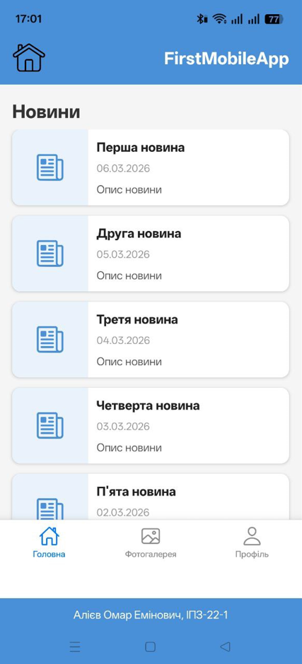
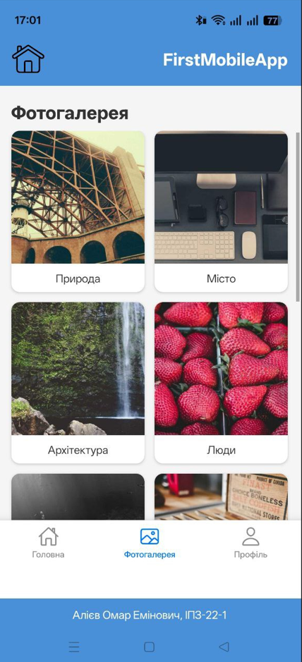
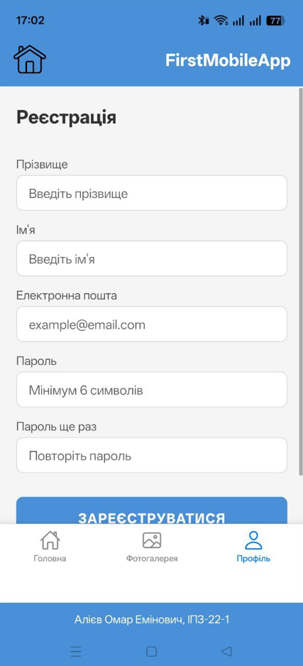

## Лабораторна робота №1

### Тема: Використання Expo для створення найпростішого додатку React

#### Встановлення:

`npx create-expo-app@latest --template`

√ Choose a template: » Blank

√ What is your app named? ... my-app

#### Проблема з сумісностю версій в Expo Go на телефоні :

Проблема була пов'язана з тим, що на телефоні остання версія програми була застаріла,
ніж та, яка завантажувалась при створенні проекту.

Тому змінив версію expo в package.json - "expo": "~54.0.6"

#### Запуск :

`cd my-app`

`npm start`

