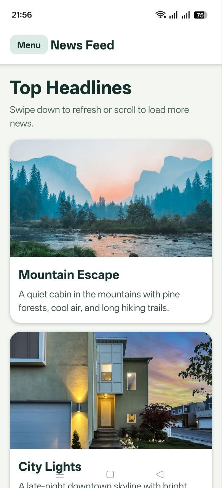
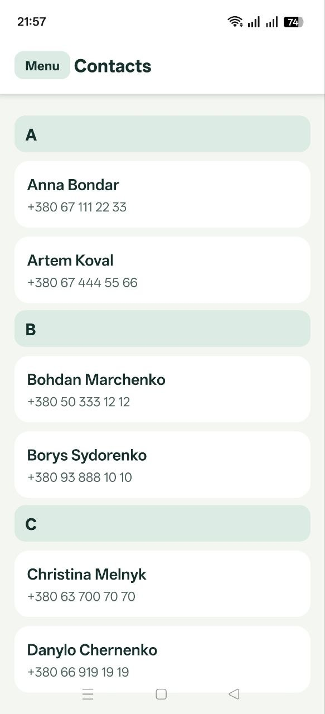
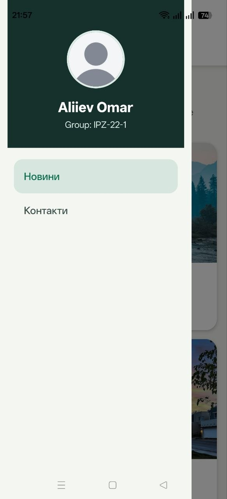

# Лабораторна робота №2

Цей проєкт виконаний з використанням `Expo SDK 54`. 

## Що реалізовано

- головний екран `MainScreen` зі списком новин на `FlatList`
- `Pull-to-refresh` через `refreshing` та `onRefresh`
- `Infinite Scroll` через `onEndReached` та `onEndReachedThreshold`
- використання `ListHeaderComponent`, `ListFooterComponent`, `ItemSeparatorComponent`
- оптимізація списку через `initialNumToRender`, `maxToRenderPerBatch`, `windowSize`
- екран деталей `DetailsScreen` з передачею параметрів між екранами
- динамічний заголовок для екрану деталей
- навігація у структурі `Drawer Navigator -> Stack Navigator`
- екран `ContactsScreen` на `SectionList`
- використання `sections`, `renderItem`, `renderSectionHeader`, `keyExtractor`, `ItemSeparatorComponent`
- кастомне drawer-меню з аватаром, ПІБ, групою та пунктами меню





## Додані залежності

У проєкт були додані бібліотеки:

- `@react-navigation/native`
- `@react-navigation/stack`
- `@react-navigation/drawer`
- `react-native-gesture-handler`
- `react-native-reanimated`
- `react-native-safe-area-context`
- `react-native-screens`
- `react-native-worklets`

## Структура проєкту

- [App.js](..\lab2\App.js) - точка входу застосунку
- [AppNavigator.js](..\lab2\navigation\AppNavigator.js) - налаштування навігації
- [MainScreen.js](..\lab2\screens\MainScreen.js) - головний екран новин
- [DetailsScreen.js](..\lab2\screens\DetailsScreen.js) - екран деталей
- [ContactsScreen.js](..\lab2\screens\ContactsScreen.js) - екран контактів
- [CustomDrawerContent.js](..\lab2\components\CustomDrawerContent.js) - кастомне меню drawer

## Запуск проєкту

Для запуску застосунку:

```bash
  npx expo start
```
