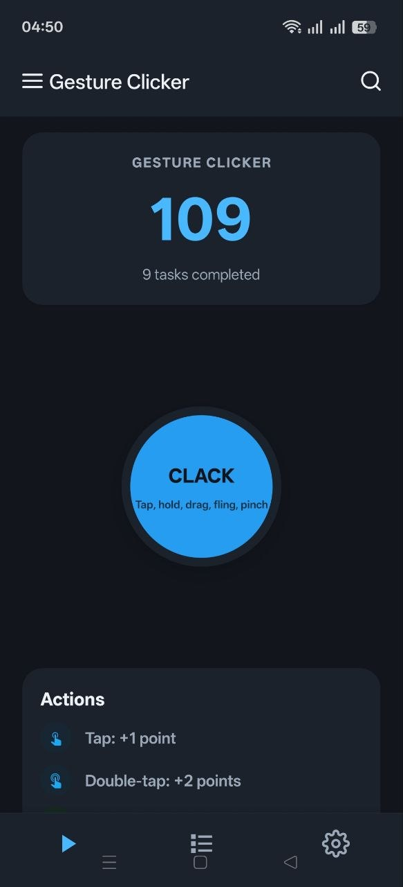
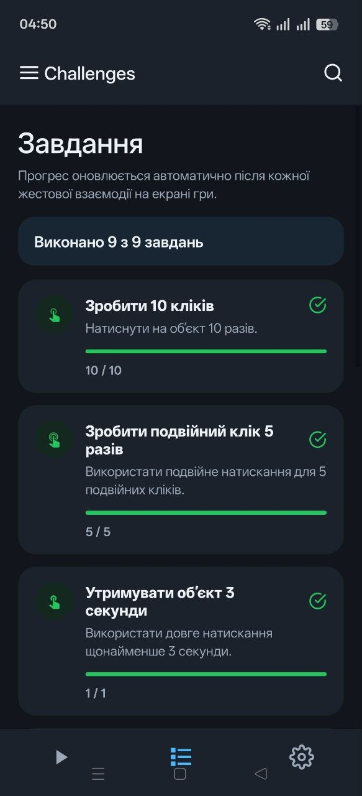
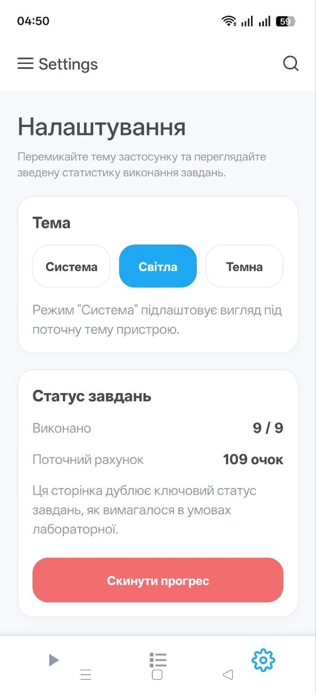

# Лабораторна робота №3

Цей проєкт виконаний з використанням `Expo SDK 54`.

## Використані технології

- `React Native`
- `Expo SDK 54.0.6`
- `@react-navigation/native`
- `@react-navigation/bottom-tabs`
- `react-native-gesture-handler`
- `react-native-reanimated`
- `styled-components`
- `React Context`

## Інструкція запуску

1. Перейти в папку проєкту:

```bash
  cd lab3
```

2. Встановити залежності:

```bash
  npm install
```

3. Запустити застосунок:

```bash
  npm start
```





## Код

### 1. Підключення жестів у застосунку

У кореневому компоненті застосунок обгорнуто в `GestureHandlerRootView`, щоб усі gesture handlers працювали коректно:

```jsx
export default function App() {
  return (
    <GestureHandlerRootView style={{ flex: 1 }}>
      <AppContent />
    </GestureHandlerRootView>
  );
}
```

Реалізація знаходиться у [App.js](../lab3/lab3/App.js).

### 2. Де реалізовано жести

Усі основні жести реалізовані в компоненті [ScoreOrb.js](../lab3/lab3/src/components/ScoreOrb.js).

#### Одинарний тап

```jsx
<TapGestureHandler waitFor={[doubleTapRef, longPressRef]} onHandlerStateChange={handleSingleTap}>
```

Обробник:

```jsx
const handleSingleTap = ({ nativeEvent }) => {
  if (nativeEvent.state === State.ACTIVE) {
    onSingleTap();
  }
};
```

#### Подвійний тап

```jsx
<TapGestureHandler
  ref={doubleTapRef}
  numberOfTaps={2}
  waitFor={longPressRef}
  onHandlerStateChange={handleDoubleTap}
>
```

Обробник:

```jsx
const handleDoubleTap = ({ nativeEvent }) => {
  if (nativeEvent.state === State.ACTIVE) {
    onDoubleTap();
  }
};
```

#### Довге натискання

```jsx
<LongPressGestureHandler
  ref={longPressRef}
  minDurationMs={3000}
  maxDist={20}
  simultaneousHandlers={[panRef, pinchRef]}
  onHandlerStateChange={handleLongPress}
>
```

Обробник:

```jsx
const handleLongPress = ({ nativeEvent }) => {
  if (nativeEvent.state === State.ACTIVE) {
    const duration = Math.max(Date.now() - longPressStart.current, nativeEvent.duration || 0);
    onLongPress(duration);
  }
};
```

#### Перетягування об’єкта

Для перетягування використано `PanGestureHandler` та `Animated.ValueXY`:

```jsx
<PanGestureHandler ref={panRef} onGestureEvent={handlePanGesture} onHandlerStateChange={handlePanStateChange}>
```

```jsx
const translation = useRef(new Animated.ValueXY()).current;
```

Після відпускання кнопка повертається в центр:

```jsx
Animated.spring(translation, {
  toValue: { x: 0, y: 0 },
  useNativeDriver: false,
  friction: 6,
  tension: 70,
}).start();
```

#### Свайп вліво / вправо

Свайп визначається під час завершення `pan`-жесту за зміщенням або швидкістю:

```jsx
const { translationX = 0, velocityX = 0 } = nativeEvent;
const isSwipe = Math.abs(translationX) > 70 || Math.abs(velocityX) > 700;

if (isSwipe) {
  onFling(translationX >= 0 ? 'right' : 'left');
}
```

#### Масштабування кнопки

Для зміни розміру використано `PinchGestureHandler`:

```jsx
<PinchGestureHandler
  ref={pinchRef}
  onGestureEvent={handlePinchGesture}
  onHandlerStateChange={handlePinchStateChange}
  simultaneousHandlers={panRef}
>
```

Обробка масштабу:

```jsx
const handlePinchGesture = Animated.event([{ nativeEvent: { scale: pinchScale } }], {
  useNativeDriver: false,
  listener: (event) => {
    const { scale: gestureScale = 1 } = event.nativeEvent || {};

    if (!pinchRewarded.current && Math.abs(gestureScale - 1) > 0.18) {
      pinchRewarded.current = true;
      onPinch(gestureScale);
    }
  },
});
```

### 3. Нарахування очок

Логіка нарахування очок винесена у [game-context.js](../lab3/lab3/src/game-context.js).

Базове нарахування:

```jsx
const addScore = (amount, message, statKey) => {
  setScore((current) => current + amount);
  if (message) {
    setActivity(message);
  }
  if (statKey) {
    setStats((current) => ({
      ...current,
      [statKey]: current[statKey] + 1,
    }));
  }
};
```

Приклад використання на екрані гри:

```jsx
const handleSingleTap = () => {
  addScore(1, 'Коротке натискання: +1 очко.', 'taps');
};

const handleDoubleTap = () => {
  addScore(2, 'Подвійний клік: +2 очки.', 'doubleTaps');
};
```

Реалізація знаходиться у [GameScreen.js](../lab3/lab3/src/screens/GameScreen.js).

### 4. Реалізація завдань

Усі завдання описані окремим масивом у [tasks.js](../lab3/lab3/src/tasks.js).

Приклад одного із завдань:

```jsx
{
  id: 'double-five',
  title: 'Зробити подвійний клік 5 разів',
  description: 'Використати подвійне натискання для 5 подвійних кліків.',
  getProgress: ({ stats }) => stats.doubleTaps,
  target: 5,
}
```

Поточний прогрес рахується функцією:

```jsx
export function evaluateTasks(gameState) {
  return TASK_DEFINITIONS.map((task) => {
    const progress = task.getProgress(gameState);
    const completed = progress >= task.target;

    return {
      ...task,
      progress,
      completed,
    };
  });
}
```

### 5. Навігація між екранами

Для навігації використано `Bottom Tab Navigator`:

```jsx
const Tab = createBottomTabNavigator();
```

Підключення екранів:

```jsx
<Tab.Screen name="Game" component={GameScreen} options={{ title: 'Gesture Clicker' }} />
<Tab.Screen name="Challenges" component={TasksScreen} options={{ title: 'Challenges' }} />
<Tab.Screen name="Settings" component={SettingsScreen} options={{ title: 'Settings' }} />
```

### 6. Темізація та стилізація

Для стилізації використано `styled-components`, а для теми окремо створені світла і темна палітри у [theme.js](/G:/4Cours/React%20Native/lab3/lab3/src/theme.js).

Приклад:

```jsx
export const lightTheme = {
  colors: {
    background: '#f6f8fb',
    surface: '#ffffff',
    accent: '#1ea8f2',
  },
};
```

Підключення теми:

```jsx
<ThemeProvider theme={palette}>
```

